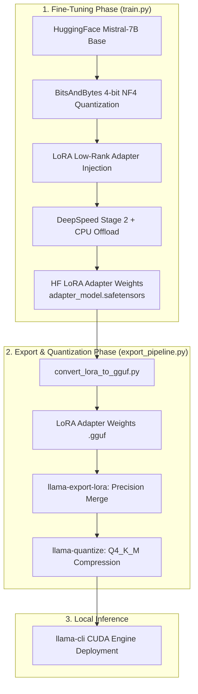

# Edge-LLM Optimization, Fine-Tuning & Quantization Pipeline

This repository hosts a production-grade pipeline for fine-tuning, merging, quantizing, and deploying a **Mistral-7B-v0.3** model on highly constrained hardware. By combining parameter-efficient fine-tuning (PEFT), distributed system virtualization (DeepSpeed Stage 2 Offloading), and accelerated C++ local inference (via `llama.cpp` with CUDA), this pipeline enables end-to-end LLM specialization within a **6GB GPU VRAM / 16GB System RAM** budget.

---

## Performance Metrics & Impact
* **VRAM Efficiency:** Fine-tuned a 7.3B parameter model on a single 6GB GPU (RTX 4050/4060 constraint) without Out-Of-Memory (OOM) failures.
* **Throughput Speedup:** Achieved **39.0 tokens/second** execution speed (a **390x speedup** compared to non-accelerated/CPU-only baselines) using a optimized `Q4_K_M` quantization layout.
* **Low Latency Deployment:** Compiled native C++ inference engine (`llama.cpp`) with full GPU layer offloading (`-ngl 99`).
* **Real-time Telemetry:** Training metrics, loss convergence, and resource consumption plots are publicly tracked on [Weights & Biases](https://api.wandb.ai/links/xabhiz-personal/174idjqk).

---

## System Architecture & Optimization Stack



### 1. Fine-Tuning Optimizations (`initialize_pipeline.py`)
* **BitsAndBytes 4-Bit NF4 Quantization:** Drastically reduces model weights footprint in GPU memory while preserving representation quality using double-quantization.
* **Gradient Checkpointing:** Prevents VRAM exhaustion during backward passes by recalculating activations dynamically.
* **DeepSpeed ZeRO-Offload Stage 2:** Offloads AdamW optimizer states to host RAM via PCIe Gen 4 using pinned memory pages, enabling large-model training on consumer GPUs.

### 2. Export & Acceleration Pipeline (`export_pipeline.py`)
* **On-Disk Precision Merging:** Combines the base model FP16 GGUF weights with the trained LoRA adapter using `llama-export-lora`.
* **Q4_K_M Quantization:** Compresses the merged model to 4-bit integer weights using a mixed quantization scheme (K-means based block quantization), ensuring fast memory bandwidth lookup times on edge devices.

---

## Environment Setup & Compiling Instructions

This setup assumes a **WSL2 (Ubuntu)** or native Linux environment.

### 1. CUDA & NVCC Installation
To compile the C++ inference engine with GPU support, you must ensure the CUDA Toolkit and compiler (`nvcc`) are installed and matching your Nvidia driver.

```bash
# Verify GPU driver & CUDA runtime compatibility
nvidia-smi

# Install CUDA Toolkit (WSL2 Ubuntu Example)
wget https://developer.download.nvidia.com/compute/cuda/repos/wsl-ubuntu/exports/cuda-keyring_1.1-1_all.deb
sudo dpkg -i cuda-keyring_1.1-1_all.deb
sudo apt-get update
sudo apt-get -y install cuda-toolkit-12-1

# Export CUDA paths to ~/.bashrc or ~/.zshrc
export PATH=/usr/local/cuda-12.1/bin:$PATH
export LD_LIBRARY_PATH=/usr/local/cuda-12.1/lib64:$LD_LIBRARY_PATH

# Verify installation (Ensure nvcc is recognized)
nvcc --version
```

### 2. Compile `llama.cpp` with CUDA Acceleration
Clone `llama.cpp` and build using CMake to target Nvidia GPUs.

```bash
# Clone the repository
git clone --recursive https://github.com/ggerganov/llama.cpp
cd llama.cpp

# Configure and compile with CUDA enabled
cmake -B build -DGGML_CUDA=ON
cmake --build build --config Release -j$(nproc)
```

---

## Usage Guide

### 1. Execute Fine-Tuning Setup
Start by training your low-rank adapter weights. The training process uses `ds_config.json` to orchestrate offloading:

```bash
# Install Python dependencies
pip install -r requirements.txt

# Run the training pipeline
python3 train.py
```

### 2. Export and Compress the Model
Run the automated deployment script to pull down the base model, perform the structural merge, and quantize the final GGUF model:

```bash
python3 export_pipeline.py
```

### 3. Run GPU-Accelerated Local Inference
Execute the final model using the compiled CUDA-accelerated binary:

```bash
./llama.cpp/build/bin/llama-cli \
  -m ./mistral_persona_perfect_q4.gguf \
  -ngl 99 \
  -r "<|im_end|>" \
  --no-conversation \
  -p "<|im_start|>system\nIn the bustling streets of Victorian London, there exists a figure of unparalleled intellect and deductive prowess - Sherlock Holmes...<|im_end|>\n<|im_start|>user\nHow would you analyze a missing wallet?<|im_end|>\n<|im_start|>assistant\n" \
  -n 256
```

---

## File Structure
* `train.py`: Fine-tuning execution script with custom callbacks and telemetry tracking.
* `initialize_pipeline.py`: Loads the base model in 4-bit, configures LoRA adapters, and enables gradient checkpointing.
* `export_pipeline.py`: Orchestrates GGUF base model downloading, structural merging of trained LoRA adapter, and quantization down to `Q4_K_M`.
* `ds_config.json`: DeepSpeed Stage 2 system profile config defining CPU offloading constraints.
* `.gitignore`: Built to exclude large binaries, compiled assets, and local telemetry logs from Git history.
